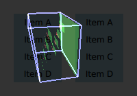

# QtQuick.qtquick-visualcanvas-scenegraph-renderer

<!-- $$$qtquick-visualcanvas-scenegraph-renderer.html-description -->

This document explains how the scene graph renderer works internally so that one can write code that uses it in an optimal fashion, both performance-wise and feature-wise.

One does not need to understand the internals of the renderer to get good performance. However, it might help when integrating with the scene graph or to figure out why it is not possible to squeeze the maximum efficiency out of the graphics chip.

<b>Note: </b>Even in the case where every frame is unique and everything is uploaded from scratch, the default renderer will perform well.

The Qt Quick items in a QML scene populates a tree of QSGNode instances. Once created, this tree is a complete description of how a certain frame should be rendered. It does not contain any references back to the Qt Quick items at all and will on most platforms be processed and rendered in a separate thread. The renderer is a self contained part of the scene graph which traverses the QSGNode tree and uses geometry defined in QSGGeometryNode and shader state defined in QSGMaterial to schedule OpenGL state change and draw calls.

If needed, the renderer can be completely replaced using the internal scene graph back-end API. This is mostly interesting for platform vendors who wish to take advantage of non-standard hardware features. For majority of use cases, the default renderer will be sufficient.

The default renderer focuses on two primary strategies to optimize the rendering. Batching of draw calls and retention of geometry on the GPU.

<h2 id="batching">Batching</h2>

Where a traditional 2D API, such as QPainter, Cairo or <a href="QtQuick.Context2D.md">Context2D</a>, is written to handle thousands of individual draw calls per frame, OpenGL is a pure hardware API and performs best when the number of draw calls is very low and state changes are kept to a minimum. Consider the following use case:

The simplest way of drawing this list is on a cell-by-cell basis. First the background is drawn. This is a rectangle of a specific color. In OpenGL terms this means selecting a shader program to do solid color fills, setting up the fill color, setting the transformation matrix containing the x and y offsets and then using for instance <code>glDrawArrays</code> to draw two triangles making up the rectangle. The icon is drawn next. In OpenGL terms this means selecting a shader program to draw textures, selecting the active texture to use, setting the transformation matrix, enabling alpha-blending and then using for instance <code>glDrawArrays</code> to draw the two triangles making up the bounding rectangle of the icon. The text and separator line between cells follow a similar pattern. And this process is repeated for every cell in the list, so for a longer list, the overhead imposed by OpenGL state changes and draw calls completely outweighs the benefit that using a hardware accelerated API could provide.

When each primitive is large, this overhead is negligible, but in the case of a typical UI, there are many small items which add up to a considerable overhead.

The default scene graph renderer works within these limitations and will try to merge individual primitives together into batches while preserving the exact same visual result. The result is fewer OpenGL state changes and a minimal amount of draw calls, resulting in optimal performance.

<h3 >Opaque Primitives</h3>

The renderer separates between opaque primitives and primitives which require alpha blending. By using OpenGL's Z-buffer and giving each primitive a unique z position, the renderer can freely reorder opaque primitives without any regard for their location on screen and which other elements they overlap with. By looking at each primitive's material state, the renderer will create opaque batches. From Qt Quick core item set, this includes Rectangle items with opaque colors and fully opaque images, such as JPEGs or BMPs.

Another benefit of using opaque primitives, is that opaque primitives does not require <code>GL_BLEND</code> to be enabled which can be quite costly, especially on mobile and embedded GPUs.

Opaque primitives are rendered in a front-to-back manner with <code>glDepthMask</code> and <code>GL_DEPTH_TEST</code> enabled. On GPUs that internally do early-z checks, this means that the fragment shader does not need to run for pixels or blocks of pixels that are obscured. Beware that the renderer still needs to take these nodes into account and the vertex shader is still run for every vertex in these primitives, so if the application knows that something is fully obscured, the best thing to do is to explicitly hide it using <a href="QtQuick.Item.md#visible-prop">Item::visible</a> or <a href="QtQuick.Item.md#opacity-prop">Item::opacity</a>.

<b>Note: </b>The <a href="QtQuick.Item.md#z-prop">Item::z</a> is used to control an Item's stacking order relative to its siblings. It has no direct relation to the renderer and OpenGL's Z-buffer.

<h3 >Alpha Blended Primitives</h3>

Once opaque primitives have been drawn, the renderer will disable <code>glDepthMask</code>, enable <code>GL_BLEND</code> and render all alpha blended primitives in a back-to-front manner.

Batching of alpha blended primitives requires a bit more effort in the renderer as elements that are overlapping need to be rendered in the correct order for alpha blending to look correct. Relying on the Z-buffer alone is not enough. The renderer does a pass over all alpha blended primitives and will look at their bounding rect in addition to their material state to figure out which elements can be batched and which can not.

In the left-most case, the blue backgrounds can be drawn in one call and the two text elements in another call, as the texts only overlap a background which they are stacked in front of. In the right-most case, the background of &quot;Item 4&quot; overlaps the text of &quot;Item 3&quot; so in this case, each of backgrounds and texts need to be drawn using separate calls.

Z-wise, the alpha primitives are interleaved with the opaque nodes and may trigger early-z when available, but again, setting <a href="QtQuick.Item.md#visible-prop">Item::visible</a> to false is always faster.

<h3 >Mixing with 3D primitives</h3>

The scene graph can support pseudo 3D and proper 3D primitives. For instance, one can implement a &quot;page curl&quot; effect using a ShaderEffect or implement a bumpmapped torus using QSGGeometry and a custom material. While doing so, one needs to take into account that the default renderer already makes use of the depth buffer.

The renderer modifies the vertex shader returned from QSGMaterialShader::vertexShader() and compresses the z values of the vertex after the model-view and projection matrices has been applied and then adds a small translation on the z to position it the correct z position.

The compression assumes that the z values are in the range of 0 to 1.

<h3 >Texture Atlas</h3>

The active texture is a unique OpenGL state, which means that multiple primitives using different OpenGL textures cannot be batched. The Qt Quick scene graph for this reason allows multiple QSGTexture instances to be allocated as smaller sub-regions of a larger texture; a texture atlas.

The biggest benefit of texture atlases is that multiple QSGTexture instances now refer to the same OpenGL texture instance. This makes it possible to batch textured draw calls as well, such as Image items, BorderImage items, ShaderEffect items and also C++ types such as QSGSimpleTextureNode and custom QSGGeometryNodes using textures.

<b>Note: </b>Large textures do not go into the texture atlas.

Atlas based textures are created by passing QQuickWindow::TextureCanUseAtlas to the QQuickWindow::createTextureFromImage().

<b>Note: </b>Atlas based textures do not have texture coordinates ranging from 0 to 1. Use QSGTexture::normalizedTextureSubRect() to get the atlas texture coordinates.

The scene graph uses heuristics to figure out how large the atlas should be and what the size threshold for being entered into the atlas is. If different values are needed, it is possible to override them using the environment variables <code>QSG_ATLAS_WIDTH=[width]</code>, <code>QSG_ATLAS_HEIGHT=[height]</code> and <code>QSG_ATLAS_SIZE_LIMIT=[size]</code>. Changing these values will mostly be interesting for platform vendors.

<h2 id="batch-roots">Batch Roots</h2>

In addition to mergin compatible primitives into batches, the default renderer also tries to minimize the amount of data that needs to be sent to the GPU for every frame. The default renderer identifies subtrees which belong together and tries to put these into separate batches. Once batches are identified, they are merged, uploaded and stored in GPU memory, using Vertex Buffer Objects.

<h3 >Transform Nodes</h3>

Each Qt Quick Item inserts a QSGTransformNode into the scene graph tree to manage its x, y, scale or rotation. Child items will be populated under this transform node. The default renderer tracks the state of transform nodes between frames, and will look at subtrees to decide if a transform node is a good candidate to become a root for a set of batches. A transform node which changes between frames and which has a fairly complex subtree, can become a batch root.

QSGGeometryNodes in the subtree of a batch root are pre-transformed relative to the root on the CPU. They are then uploaded and retained on the GPU. When the transform changes, the renderer only needs to update the matrix of the root, not each individual item, making list and grid scrolling very fast. For successive frames, as long as nodes are not being added or removed, rendering the list is effectively for free. When new content enters the subtree, the batch that gets it is rebuilt, but this is still relatively fast. There are usually several unchanging frames for every frame with added or removed nodes when panning through a grid or list.

Another benefit of identifying transform nodes as batch roots is that it allows the renderer to retain the parts of the tree that has not changed. For instance, say a UI consists of a list and a button row. When the list is being scrolled and delegates are being added and removed, the rest of the UI, the button row, is unchanged and can be drawn using the geometry already stored on the GPU.

The node and vertex threshold for a transform node to become a batch root can be overridden using the environment variables <code>QSG_RENDERER_BATCH_NODE_THRESHOLD=[count]</code> and <code>QSG_RENDERER_BATCH_VERTEX_THRESHOLD=[count]</code>. Overriding these flags will be mostly useful for platform vendors.

<b>Note: </b>Beneath a batch root, one batch is created for each unique set of material state and geometry type.

<h3 >Clipping</h3>

When setting Item::clip to true, it will create a QSGClipNode with a rectangle in its geometry. The default renderer will apply this clip by using scissoring in OpenGL. If the item is rotated by a non-90-degree angle, the OpenGL's stencil buffer is used. Qt Quick Item only supports setting a rectangle as clip through QML, but the scene graph API and the default renderer can use any shape for clipping.

When applying a clip to a subtree, that subtree needs to be rendered with a unique OpenGL state. This means that when <a href="QtQuick.Item.md#clip-prop">Item::clip</a> is true, batching of that item is limited to its children. When there are many children, like a <a href="QtQuick.ListView.md">ListView</a> or <a href="QtQuick.draganddrop.md#gridview">GridView</a>, or complex children, like a TextArea, this is fine. One should, however, use clip on smaller items with caution as it prevents batching. This includes button label, text field or list delegate and table cells.

<h3 >Vertex Buffers</h3>

Each batch uses a vertex buffer object (VBO) to store its data on the GPU. This vertex buffer is retained between frames and updated when the part of the scene graph that it represents changes.

By default, the renderer will upload data into the VBO using <code>GL_STATIC_DRAW</code>. It is possible to select different upload strategy by setting the environment variable <code>QSG_RENDERER_BUFFER_STRATEGY=[strategy]</code>. Valid values are <code>stream</code> and <code>dynamic</code>. Changing this value is mostly useful for platform vendors.

<h2 id="antialiasing">Antialiasing</h2>

The scene graph supports two types of antialiasing. By default, primitives such as rectangles and images will be antialiased by adding more vertices along the edge of the primitives so that the edges fade to transparent. We call this method <i>vertex antialiasing</i>. If the user requests a multisampled OpenGL context, by setting a QSurfaceFormat with samples greater than <code>0</code> using QQuickWindow::setFormat(), the scene graph will prefer multisample based antialiasing (MSAA). The two techniques will affect how the rendering happens internally and have different limitations.

It is also possible to override the antialiasing method used by setting the environment variable <code>QSG_ANTIALIASING_METHOD</code> to either <code>vertex</code> or <code>msaa</code>.

Vertex antialiasing can produce seams between edges of adjacent primitives, even when the two edges are mathmatically the same. Multisample antialiasing does not.

<h3 >Vertex Antialiasing</h3>

Vertex antialiasing can be enabled and disabled on a per-item basis using the <a href="QtQuick.Item.md#antialiasing-prop">Item::antialiasing</a> property. It will work regardless of what the underlying hardware supports and produces higher quality antialiasing, both for normally rendered primitives and also for primitives captured into framebuffer objects, for instance using the <a href="QtQuick.ShaderEffectSource.md">ShaderEffectSource</a> type.

The downside to using vertex antialiasing is that each primitive with antialiasing enabled will have to be blended. In terms of batching, this means that the renderer needs to do more work to figure out if the primitive can be batched or not and due to overlaps with other elements in the scene, it may also result in less batching, which could impact performance.

On low-end hardware blending can also be quite expensive so for an image or rounded rectangle that covers most of the screen, the amount of blending needed for the interior of these primitives can result in significant performance loss as the entire primitive must be blended.

<h3 >Multisample Antialiasing</h3>

Multisample antialiasing is a hardware feature where the hardware calculates a coverage value per pixel in the primitive. Some hardware can multisample at a very low cost, while other hardware may need both more memory and more GPU cycles to render a frame.

Using multisample antialiasing, many primitives, such as rounded rectangles and image elements can be antialiased and still be <i>opaque</i> in the scene graph. This means the renderer has an easier job when creating batches and can rely on early-z to avoid overdraw.

When multisample antialiasing is used, content rendered into framebuffer objects, need additional extensions to support multisampling of framebuffers. Typically <code>GL_EXT_framebuffer_multisample</code> and <code>GL_EXT_framebuffer_blit</code>. Most desktop chips have these extensions present, but they are less common in embedded chips. When framebuffer multisampling is not available in the hardware, content rendered into framebuffer objects will not be antialiased, including the content of a <a href="QtQuick.ShaderEffectSource.md">ShaderEffectSource</a>.

<h2 id="performance">Performance</h2>

As stated in the beginning, understanding the finer details of the renderer is not required to get good performance. It is written to optimize for common use cases and will perform quite well under almost any circumstance.

<ul>
<li>Good performance comes from effective batching, with as little as possible of the geometry being uploaded again and again. By setting the environment variable <code>QSG_RENDERER_DEBUG=render</code>, the renderer will output statistics on how well the batching goes, how many batches, which batches are retained and which are opaque and not. When striving for optimal performance, uploads should happen only when really needed, batches should be fewer than 10 and at least 3-4 of them should be opaque.</li>
<li>The default renderer does not do any CPU-side viewport clipping nor occlusion detection. If something is not supposed to be visible, it should not be shown. Use <code>Item::visible: false</code> for items that should not be drawn. The primary reason for not adding such logic is that it adds additional cost which would also hurt applications that took care in behaving well.</li>
<li>Make sure the texture atlas is used. The Image and BorderImage items will use it unless the image is too large. For textures created in C++, pass QQuickWindow::TextureCanUseAtlas when calling QQuickWindow::createTexture(). By setting the environment variable <code>QSG_ATLAS_OVERLAY</code> all atlas textures will be colorized so they are easily identifiable in the application.</li>
<li>Use opaque primitives where possible. Opaque primitives are faster to process in the renderer and faster to draw on the GPU. For instance, PNG files will often have an alpha channel, even though each pixel is fully opaque. JPG files are always opaque. When providing images to an QQuickImageProvider or creating images with QQuickWindow::createTextureFromImage(), let the image have QImage::Format_RGB32, when possible.</li>
<li>Be aware of that overlapping compond items, like in the illustration above, can not be batched.</li>
<li>Clipping breaks batching. Never use on a per-item basis, inside tables cells, item delegates or similar. Instead of clipping text, use eliding. Instead of clipping an image, create a QQuickImageProvider that returns a cropped image.</li>
<li>Batching only works for 16-bit indices. All built-in items use 16-bit indices, but custom geometry is free to also use 32-bit indices.</li>
<li>Some material flags prevent batching, the most limiting one being QSGMaterial::RequiresFullMatrix which prevents all batching.</li>
<li>Applications with a monochrome background should set it using QQuickWindow::setColor() rather than using a top-level Rectangle item. QQuickWindow::setColor() will be used in a call to <code>glClear()</code>, which is potentially faster.</li>
<li>Mipmapped Image items are not placed in global atlas and will not be batched.</li>
</ul>

If an application performs poorly, make sure that rendering is actually the bottleneck. Use a profiler! The environment variable <code>QSG_RENDER_TIMING=1</code> will output a number of useful timing parameters which can be useful in pinpointing where a problem lies.

<h2 id="visualizing">Visualizing</h2>

To visualize the various aspects of the scene graph's default renderer, the <code>QSG_VISUALIZE</code> environment variable can be set to one of the values detailed in each section below. We provide examples of the output of some of the variables using the following QML code:

<pre class="cpp">import QtQuick 2.2
Rectangle {
width: 200
height: 140
ListView {
id: clippedList
x: 20
y: 20
width: 70
height: 100
clip: true
model: [&quot;Item A&quot;, &quot;Item B&quot;, &quot;Item C&quot;, &quot;Item D&quot;]
delegate: Rectangle {
color: &quot;lightblue&quot;
width: parent.width
height: 25
Text {
text: modelData
anchors.fill: parent
horizontalAlignment: Text.AlignHCenter
verticalAlignment: Text.AlignVCenter
}
}
}
ListView {
id: clippedDelegateList
x: clippedList.x + clippedList.width + 20
y: 20
width: 70
height: 100
clip: true
model: [&quot;Item A&quot;, &quot;Item B&quot;, &quot;Item C&quot;, &quot;Item D&quot;]
delegate: Rectangle {
color: &quot;lightblue&quot;
width: parent.width
height: 25
clip: true
Text {
text: modelData
anchors.fill: parent
horizontalAlignment: Text.AlignHCenter
verticalAlignment: Text.AlignVCenter
}
}
}
}</pre>

For the <a href="QtQuick.ListView.md">ListView</a> on the left, we set its <a href="QtQuick.Item.md#clip-prop">clip</a> property to <code>true</code>. For the <a href="QtQuick.ListView.md">ListView</a> on right, we also set each delegate's <a href="QtQuick.Item.md#clip-prop">clip</a> property to <code>true</code> to illustrate the effects of clipping on batching.

Original

<b>Note: </b>The visualized elements do not respect clipping, and rendering order is arbitrary.

<h3 >Visualizing Batches</h3>

Setting <code>QSG_VISUALIZE</code> to <code>batches</code> visualizes batches in the renderer. Merged batches are drawn with a solid color and unmerged batches are drawn with a diagonal line pattern. Few unique colors means good batching. Unmerged batches are bad if they contain many individual nodes.

<code>QSG_VISUALIZE=batches</code>

<h3 >Visualizing Clipping</h3>

Setting <code>QSG_VISUALIZE</code> to <code>clip</code> draws red areas on top of the scene to indicate clipping. As Qt Quick Items do not clip by default, no clipping is usually visualized.

<code>QSG_VISUALIZE=clip</code>

<h3 >Visualizing Changes</h3>

Setting <code>QSG_VISUALIZE</code> to <code>changes</code> visualizes changes in the renderer. Changes in the scenegraph are visualized with a flashing overlay of a random color. Changes on a primitive are visualized with a solid color, while changes in an ancestor, such as matrix or opacity changes, are visualized with a pattern.

<h3 >Visualizing Overdraw</h3>

Setting <code>QSG_VISUALIZE</code> to <code>overdraw</code> visualizes overdraw in the renderer. Visualize all items in 3D to highlight overdraws. This mode can also be used to detect geometry outside the viewport to some extent. Opaque items are rendered with a green tint, while translucent items are rendered with a red tint. The bounding box for the viewport is rendered in blue. Opaque content is easier for the scenegraph to process and is usually faster to render.

Note that the root rectangle in the code above is superfluous as the window is also white, so drawing the rectangle is a waste of resources in this case. Changing it to an Item can give a slight performance boost.

<code>QSG_VISUALIZE=overdraw</code>

<!-- @@@qtquick-visualcanvas-scenegraph-renderer.html -->
