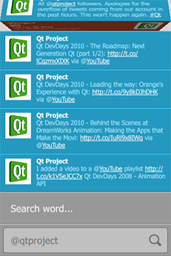

# QtQuick.qtquick-demos-tweetsearch-example

<!-- $$$demos/tweetsearch-description -->

<i>Tweet Search</i> is a QML application that searches items posted to Twitter service using a number of query parameters. Search can be done for tweets from a specified user, a hashtag, or a search phrase.

The search result is a list of items showing the contents of the tweet as well as the name and image of the user who posted it. Hashtags, names and links in the content are clickable. Clicking on the image will flip the item to reveal more information.

<h2 id="running-the-example">Running the Example</h2>

To run the example from Qt Creator, open the <b>Welcome</b> mode and select the example from <b>Examples</b>. For more information, visit Building and Running an Example.

Tweet Search uses Twitter API v1.1 for running seaches.

<h2 id="request-authentication">Request Authentication</h2>

Each request must be authenticated on behalf of the application. For demonstration purposes, the application uses a hard-coded token for identifying itself to the Twitter service. However, this token is subject to rate limits for the number of requests as well as possible expiration.

If you are having authentication or rate limit problems running the demo, obtain a set of application-specific tokens (consumer key and consumer secret) by registering a new application on <a href="https://dev.twitter.com/apps">https://dev.twitter.com/apps</a>.

Type in the two token values in <i>TweetsModel.qml</i>:

<pre class="qml">    property string consumerKey : &quot;&quot;
property string consumerSecret : &quot;&quot;</pre>

Rebuild and run the demo.

<h2 id="json-parsing">JSON Parsing</h2>

Search results are returned in JSON (JavaScript Object Notation) format. <code>TweetsModel</code> uses an XMLHTTPRequest object to send an HTTP GET request, and calls JSON.parse() on the returned text string to convert it to a JavaScript object. Each object representing a tweet is then added to a <a href="QtQuick.qtquick-modelviewsdata-modelview.md#listmodel">ListModel</a>:

<pre class="qml">        var req = new XMLHttpRequest;
req.open(&quot;GET&quot;, &quot;https://api.twitter.com/1.1/search/tweets.json?from=&quot; + from +
&quot;&amp;count=10&amp;q=&quot; + encodePhrase(phrase));
req.setRequestHeader(&quot;Authorization&quot;, &quot;Bearer &quot; + bearerToken);
req.onreadystatechange = function() {
status = req.readyState;
if (status === XMLHttpRequest.DONE) {
var objectArray = JSON.parse(req.responseText);
if (objectArray.errors !== undefined)
console.log(&quot;Error fetching tweets: &quot; + objectArray.errors[0].message)
else {
for (var key in objectArray.statuses) {
var jsonObject = objectArray.statuses[key];
tweets.append(jsonObject);
}
}
if (wasLoading == true)
wrapper.isLoaded()
}
wasLoading = (status === XMLHttpRequest.LOADING);
}
req.send();</pre>

Files:

<ul>
<li>demos/tweetsearch/tweetsearch.qml</li>
<li>demos/tweetsearch/content/FlipBar.qml</li>
<li>demos/tweetsearch/content/LineInput.qml</li>
<li>demos/tweetsearch/content/ListFooter.qml</li>
<li>demos/tweetsearch/content/ListHeader.qml</li>
<li>demos/tweetsearch/content/SearchDelegate.qml</li>
<li>demos/tweetsearch/content/TweetDelegate.qml</li>
<li>demos/tweetsearch/content/TweetsModel.qml</li>
<li>demos/tweetsearch/content/tweetsearch.js</li>
<li>demos/tweetsearch/main.cpp</li>
<li>demos/tweetsearch/tweetsearch.pro</li>
<li>demos/tweetsearch/tweetsearch.qmlproject</li>
<li>demos/tweetsearch/tweetsearch.qrc</li>
</ul>

<b>See also </b>QML Applications.

<!-- @@@demos/tweetsearch -->
